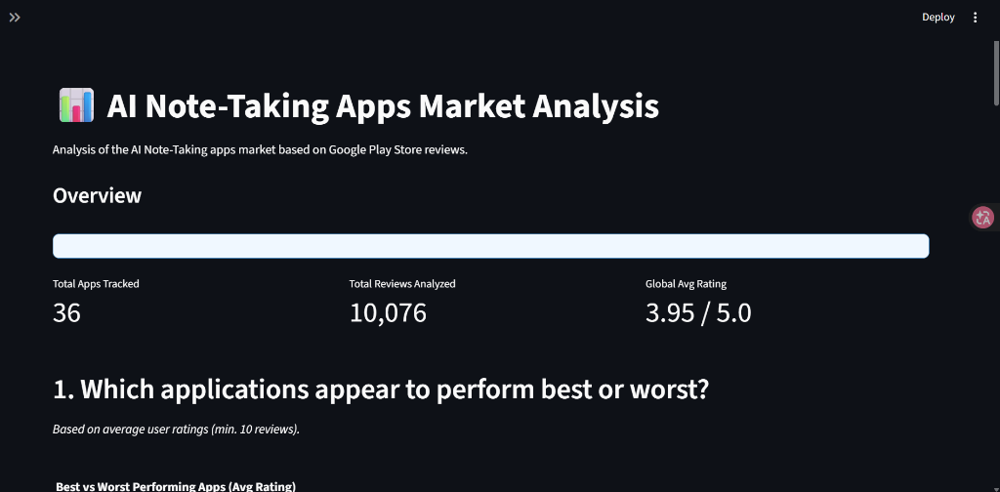
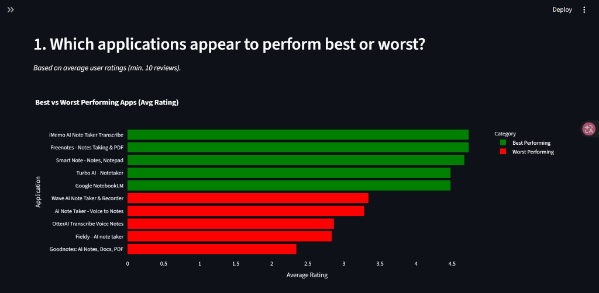
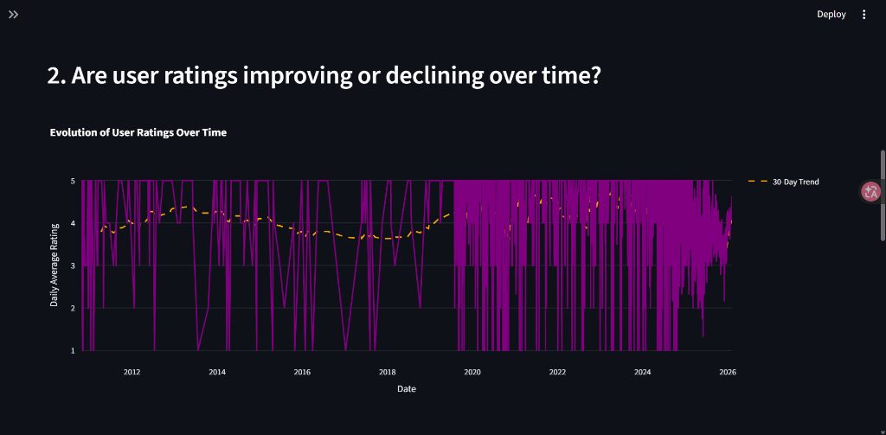
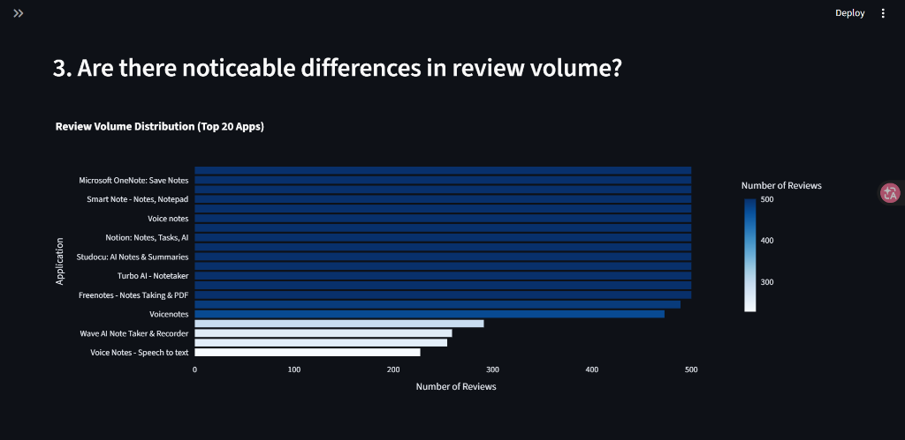

# 📱 AI Note-Taking Apps Market Analysis

## Project Overview
This project is a **Python-based Data Engineering pipeline** designed to scrape, transform, and analyze market data from the Google Play Store. It specifically targets the "AI Note-Taking" application sector to extract insights regarding market dominance, user satisfaction trends, and application quality.

The pipeline follows a standard ETL (Extract, Transform, Load) architecture, culminating in a **Streamlit Dashboard** for interactive analysis.

## 👥 Authors
*   **BELEMCOABGA Rosteim Falleiz**
*   **MENDY Vincent**

*Course: Data Engineering II (TP1)*

---

## 🏗️ Architecture
The project is structured into four main stages:

1.  **Data Acquisition (Extraction)**
    *   **Source**: Google Play Store (via `google-play-scraper`).
    *   **Output**: Raw JSON/JSONL in `data/raw/`.
    *   *Feature*: Implements robust pagination to handle large volumes of reviews.

2.  **Transformation**
    *   **Process**: Cleans raw data, handles missing values, types metrics, and standardizes formats.
    *   **Output**: Structured CSV files in `data/processed/`.

3.  **Serving Layer**
    *   **Process**: Aggregates data to generate Analysis-Ready datasets.
    *   **Output**: `app_level_kpis.csv` (Metrics per application) & `daily_metrics.csv` (Time-series).

4.  **Visualization (Dashboard)**
    *   **Tech**: Streamlit & Plotly.
    *   **Features**: Interactive filters, KPIs, and specialized charts.

---

## 📉 Dashboard Preview

### 1. Market Overview


### 2. Best vs. Worst Performing Apps


### 3. User Rating Trends


### 4. Review Volume Distribution


---

## 🚀 Installation & Usage

### Prerequisites
*   Python 3.12+
*   Poetry (Dependency Management)

### 1. Setup Environment
Since `Pyproject.toml` is located at the project root, please run the following commands **from the root directory** (`Data_Engineering_2/`):

```bash
# 1. Install dependencies
poetry install

# 2. Activate the Virtual Environment
# Retrieve the absolute path of the environment:
poetry env info --path

# Copy the path returned and run the activation script.
# Example command to run (Paste this into your terminal):
C:\Users\Falleiz\AppData\Local\pypoetry\Cache\virtualenvs\env-TDEfAvIG-py3.12\Scripts\activate.bat
```

### 2. Run the Data Pipeline
Once the environment is active, navigate to the source directory (`src`) to execute the pipeline scripts.

**Note**: The scripts rely on relative paths (`../data`), so you **must** execute them from the `src` folder.

```bash
# Navigate to source folder
cd "TP1/Data_Engineering_-_S1-2_-_Resources/App_Market_research/src"

# A. Extract Reviews (Optional)
python extract_reviews.py

# B. Transform Raw Data
python transform_data.py

# C. Create Serving Layer (KPIs)
python create_serving_layer.py
```

### 3. Launch the Dashboard
To run the dashboard, navigate to the `app` folder:

```bash
# Navigate to app folder (from src)
cd "../app"

# Launch Streamlit
streamlit run main.py
```

---

## 📊 Key Insights
The dashboard allows deeper investigation into:
*   **Market Concentration**: Identifying which apps dominate review volume.
*   **Quality vs. Popularity**: Correlating ratings with number of users.
*   **Trends**: Monitoring user satisfaction evolution over time.

## 📁 Project Structure
```
App_Market_research/
├── app/                  # Streamlit Application
│   ├── main.py           # Dashboard Entry Point
│   ├── charts.py         # Visualization Logic
│   └── utils.py          # Data Loading & Caching
├── data/                 # Data Storage (GitIgnored)
│   ├── raw/              # Raw Scraped Data
│   └── processed/        # Cleaned CSVs
├── src/                  # ETL Scripts
│   ├── extract_*.py      # Scrapers
│   ├── transform_data.py # Data Cleaning
│   └── create_serving_layer.py # Aggregation
├── lab_answers.md        # Answers to Lab Questions
├── pyproject.toml        # Project Dependencies (at Root)
└── README.md             # Project Documentation
```
