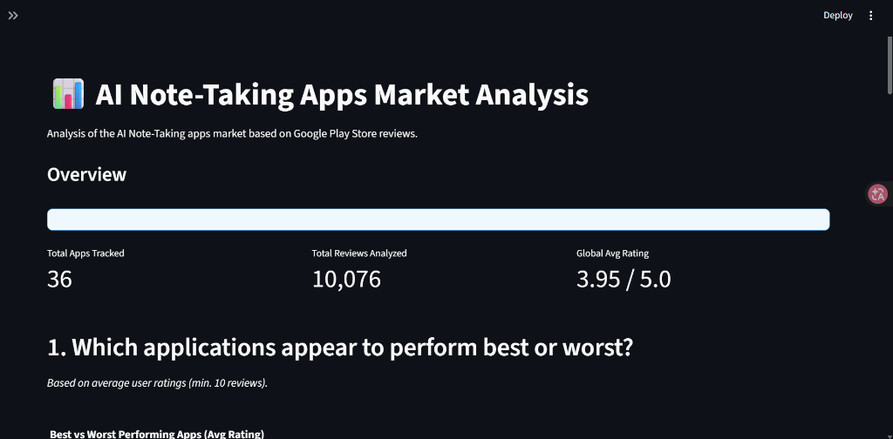
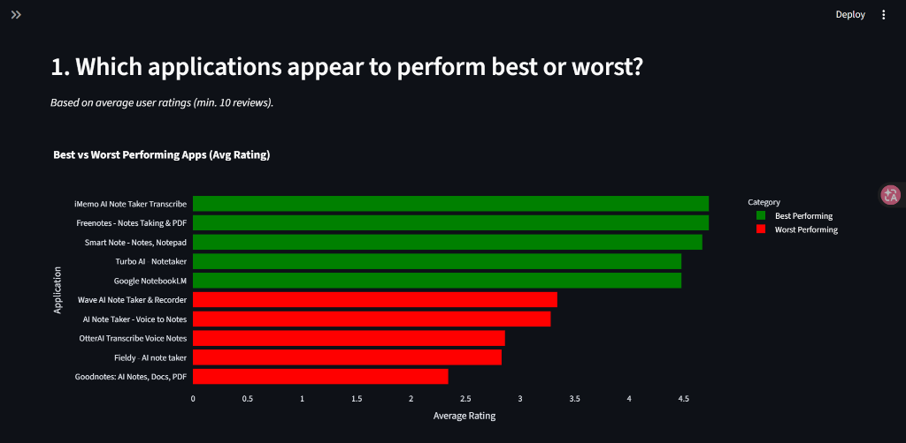
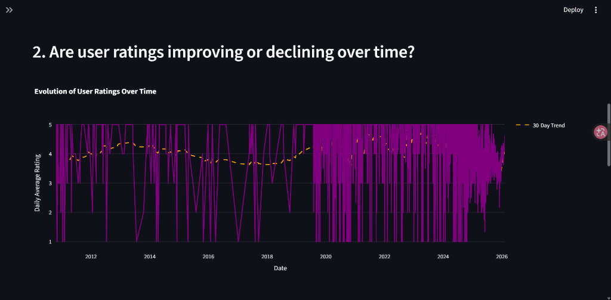
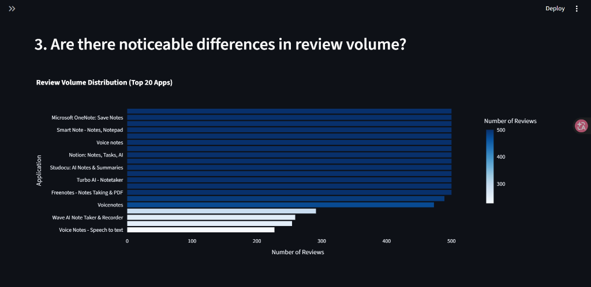

# 📱 AI Note-Taking Apps Market Analysis

## Project Overview
This project is a **Python-based Data Engineering pipeline** designed to scrape, transform, and analyze market data from the Google Play Store. It specifically targets the "AI Note-Taking" application sector to extract insights regarding market dominance, user satisfaction trends, and application quality.

The pipeline follows a standard ETL (Extract, Transform, Load) architecture, culminating in a **Streamlit Dashboard** for interactive analysis.

## 👥 Authors
*   **BELEMCOABGA Rosteim Falleiz**
*   **MENDY Vincent**

*Course: Data Engineering II (TP1)*

---

## 🏗️ Architecture
The project is structured into four main stages:

1.  **Data Acquisition (Extraction)**
    *   **Source**: Google Play Store (via `google-play-scraper`).
    *   **Output**: Raw JSON/JSONL in `data/raw/`.
    *   *Feature*: Implements robust pagination to handle large volumes of reviews.

2.  **Transformation**
    *   **Process**: Cleans raw data, handles missing values, types metrics, and standardizes formats.
    *   **Output**: Structured CSV files in `data/processed/`.

3.  **Serving Layer**
    *   **Process**: Aggregates data to generate Analysis-Ready datasets.
    *   **Output**: `app_level_kpis.csv` (Metrics per application) & `daily_metrics.csv` (Time-series).

4.  **Visualization (Dashboard)**
    *   **Tech**: Streamlit & Plotly.
    *   **Features**: Interactive filters, KPIs, and specialized charts.

---

## 📉 Dashboard Preview

### 1. Market Overview


### 2. Best vs. Worst Performing Apps


### 3. User Rating Trends


### 4. Review Volume Distribution


---

## 🚀 Installation & Usage

### Prerequisites
*   Python 3.12+
*   Poetry (Dependency Management)

### 1. Setup Environment
Since `Pyproject.toml` is located at the project root, please run the following commands **from the root directory** (`Data_Engineering_2/`):

```bash
# 1. Install dependencies
poetry install

# 2. Activate the Virtual Environment
# Retrieve the absolute path of the environment:
poetry env info --path

# Copy the path returned and run the activation script.
# Example command to run (Paste this into your terminal):
C:\Users\Falleiz\AppData\Local\pypoetry\Cache\virtualenvs\env-TDEfAvIG-py3.12\Scripts\activate.bat
```

### 2. Run the Data Pipeline
Once the environment is active, navigate to the source directory (`src`) to execute the pipeline scripts.

**Note**: The scripts rely on relative paths (`../data`), so you **must** execute them from the `src` folder.

```bash
# Navigate to source folder
cd "TP1/Data_Engineering_-_S1-2_-_Resources/App_Market_research/src"

# A. Extract Reviews (Optional)
python extract_reviews.py

# B. Transform Raw Data
python transform_data.py

# C. Create Serving Layer (KPIs)
python create_serving_layer.py
```

### 3. Launch the Dashboard
To run the dashboard, navigate to the `app` folder:

```bash
# Navigate to app folder (from src)
cd "../app"

# Launch Streamlit
streamlit run main.py
```

---

## 📊 Key Insights
The dashboard allows deeper investigation into:
*   **Market Concentration**: Identifying which apps dominate review volume.
*   **Quality vs. Popularity**: Correlating ratings with number of users.
*   **Trends**: Monitoring user satisfaction evolution over time.

## 📁 Project Structure
```
App_Market_research/
├── app/                  # Streamlit Application
│   ├── main.py           # Dashboard Entry Point
│   ├── charts.py         # Visualization Logic
│   └── utils.py          # Data Loading & Caching
├── data/                 # Data Storage (GitIgnored)
│   ├── raw/              # Raw Scraped Data
│   └── processed/        # Cleaned CSVs
├── src/                  # ETL Scripts
│   ├── extract_*.py      # Scrapers
│   ├── transform_data.py # Data Cleaning
│   └── create_serving_layer.py # Aggregation
├── lab_answers.md        # Answers to Lab Questions
├── pyproject.toml        # Project Dependencies (at Root)
└── README.md             # Project Documentation
```

---

## 🧪 Part C — Pipeline Stress Testing

In real-world data systems, pipelines rarely remain static. Part C stress-tests the pipeline against **intentionally problematic datasets** to expose hidden assumptions and structural fragilities.

### Principle

Each test dataset replaces the original upstream source entirely (full refresh). No raw file is modified manually — all adaptations are done in code.

### Scenarios

| # | Scenario | Input File | Issues Tested |
|---|---|---|---|
| 1 | **New Reviews Batch** | `note_taking_ai_reviews_batch2.csv` | Duplicate `reviewId`, unknown `app_id` |
| 2 | **Schema Drift** | `note_taking_ai_reviews_schema_drift.csv` | 8 columns renamed, different date format |
| 3 | **Dirty Data** | `note_taking_ai_reviews_dirty.csv` | Invalid score types, bad timestamps, `"NULL"` strings |
| 4 | **Updated Apps Metadata** | `note_taking_ai_apps_updated.csv` | Duplicate `appId`, missing values, inconsistent `installs` |
| 5 | **New Business Logic** | *(existing processed data)* | Sentiment vs rating contradiction detection |

### Setup & Run

```bash
# Navigate to Part C
cd "TP1/Data_Engineering_-_S1-2_-_Resources/part C"

# Install dependencies
poetry install

# Run all scenarios
poetry run python src/run_all.py

# Run a specific scenario (e.g. 1, 2, 3)
poetry run python src/run_all.py 1 2 3
```

Outputs are saved to `part C/output/` as CSV files.

### Structure

```
part C/
├── data/                         # Test datasets provided by the lab
│   ├── note_taking_ai_reviews_batch2.csv
│   ├── note_taking_ai_reviews_schema_drift.csv
│   ├── note_taking_ai_reviews_dirty.csv
│   └── note_taking_ai_apps_updated.csv
├── src/
│   ├── utils.py                  # Shared cleaning & dedup utilities
│   ├── scenario_1_batch.py
│   ├── scenario_2_schema_drift.py
│   ├── scenario_3_dirty_data.py
│   ├── scenario_4_apps_updated.py
│   ├── scenario_5_sentiment.py
│   └── run_all.py                # Entry point
├── output/                       # Generated at runtime
└── pyproject.toml
```

### Expected Console Output

```
============================================================
   PART C — STRESS TESTING PIPELINE
   Running scenarios: 1, 2, 3
============================================================

[1/5] New Reviews Batch
  [dedup]   Removed 1 duplicate(s) on 'reviewId'
  [filter]  1 review(s) reference unknown apps: com.ghost.notes
  Reviews shape: (8, 8) | Unique apps: 3

[2/5] Schema Drift
  [schema]  Columns received:    ['appId', 'appTitle', 'rating', 'likes', ...]
  [schema]  Columns normalized:  ['app_id', 'app_name', 'score', 'thumbsUpCount', ...]

[3/5] Dirty and Inconsistent Data
  [quality] 3 review(s) with invalid/missing score → set to None
  [quality] 1 review(s) with unparseable timestamp → set to NaT
  [post]    Valid scores: 7/10 | Valid timestamps: 9/10

============================================================
   All done. Outputs saved to: part C/output/
============================================================
```

### Output Files

| Scenario | Files Generated |
|---|---|
| S1 — New Batch | `s1_reviews.csv`, `s1_app_kpis.csv`, `s1_daily_metrics.csv` |
| S2 — Schema Drift | `s2_reviews.csv`, `s2_app_kpis.csv`, `s2_daily_metrics.csv` |
| S3 — Dirty Data | `s3_reviews.csv`, `s3_app_kpis.csv`, `s3_daily_metrics.csv` |
| S4 — Apps Updated | `s4_apps_catalog.csv`, `s4_app_kpis.csv` |
| S5 — Sentiment | `s5_sentiment_contradictions.csv`, `s5_sentiment_summary.csv` |
