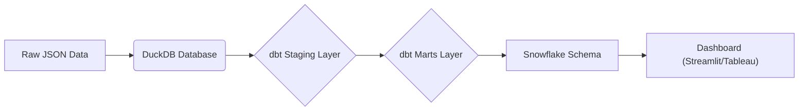
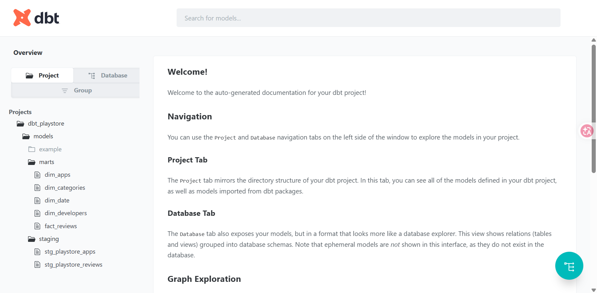
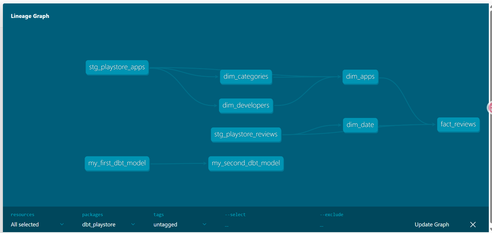
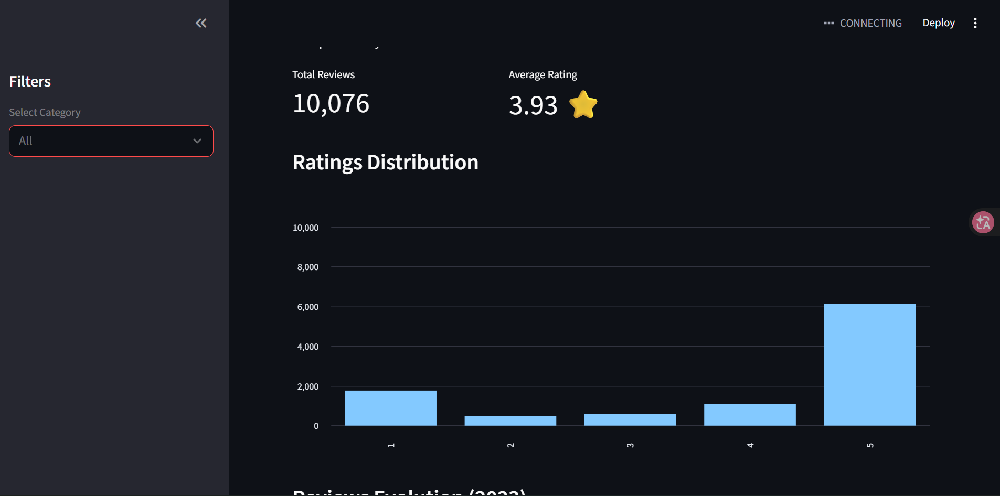
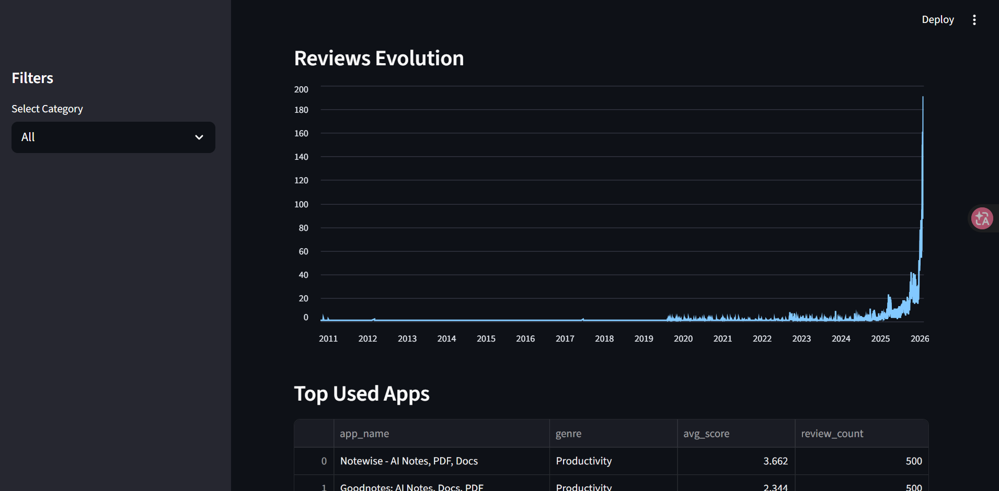

# 🛠️ TP2: Modern Data Pipeline with dbt & DuckDB

## Project Overview
This project refactors the initial Python-based ETL (from TP1) into a **modern data engineering pipeline** using **dbt (data build tool)** and **DuckDB**.

The goal is to apply **Dimensional Modeling (Kimball)** principles to build a robust, scalable, and testable data warehouse for Google Play Store analytics.

## 🏗️ Architecture



### 1. Staging Layer (`models/staging`)
- **Source**: Raw JSON files (`apps_metadata.json`, `apps_reviews.jsonl`).
- **Transformation**: Cleaning, renaming (snake_case), casting types.
- **Models**: `stg_playstore_apps`, `stg_playstore_reviews`.

### 2. Marts Layer (`models/marts`)
- **Model**: Snowflake Schema (Normalized Dimensions).
- **Fact**: `fact_reviews` (Transactional review data with Surrogate Keys).
- **Dimensions**: 
    - `dim_apps` (Application context).
    - `dim_categories` (Genre normalization).
    - `dim_developers` (Developer normalization).
    - `dim_date` (Temporal context with integer keys).

## 🚀 Usage

### Prerequisites
- Python 3.12+
- Poetry
- dbt-core, dbt-duckdb

### 1. Setup
```bash
# Install dependencies (if not already done via root pyproject.toml)
poetry install
```

### 2. Run the Pipeline
Navigate to the `TP2/dbt_playstore` directory:
```bash
cd TP2/dbt_playstore

# Run dbt models
dbt run

# Test data quality
dbt test
```

### 3. Generate Documentation
To inspect the lineage and model descriptions:
```bash
dbt docs generate
dbt docs serve
```


*Figure 1: dbt Documentation Home*


*Figure 2: Data Lineage Graph (DAG)*

### 4. Run the Dashboard
Visualize the data using the Streamlit app connected to DuckDB:
```bash
# From the TP2 root directory
streamlit run dashboard_app.py
```


*Figure 3: Dashboard Overview*


*Figure 4: Detailed Analytics*
